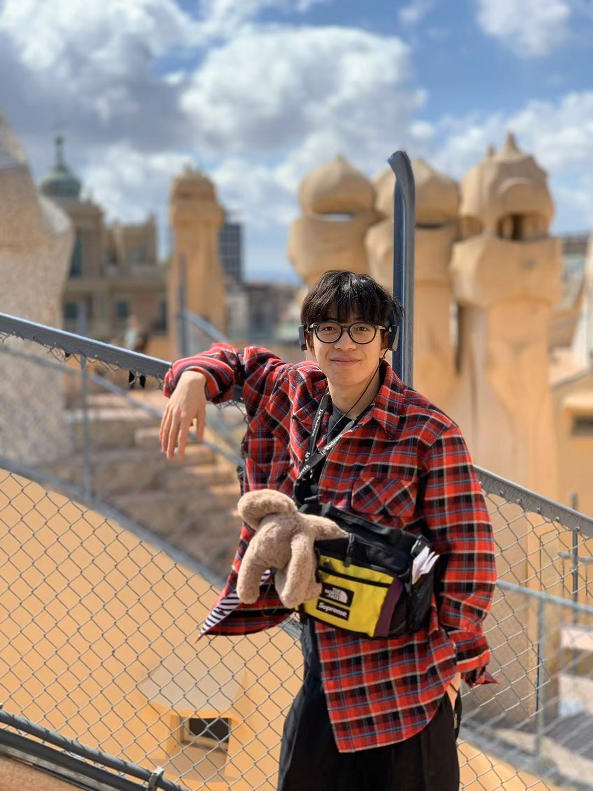

# Wentao He

 I am currently a Ph.D. candidate from the School of Computer Science, University of Nottingham Ningbo China (UNNC), advised by [Dr. Jianfeng Ren](https://research.nottingham.edu.cn/en/persons/jianfeng-ren) and [Prof. Ruibin Bai](http://www.cs.nott.ac.uk/~znzbrbb/), with the scholarship by Microsoft Research Asia (MSRA). I also receive intensive guidance by [Prof. Xudong Jiang](https://personal.ntu.edu.sg/exdjiang/default.htm) from Nanyang Technological University (NTU). I obtained the M.Sc. from Imperial College London, U.K., in 2019, supervised by [Dr. Stamatia Giannarou](https://www.imperial.ac.uk/people/stamatia.giannarou), and the B.Sc. from UNNC in 2018. 

My research interests include but are not limited to:

* Computer vision: Visual analoginal reasoning
* Signal processing: Radar gait recognition
* Operation research: Computational optimization

[[CV]()] [[Email](mailto:scxwh1@nottingham.edu.cn)] [[Google Scholar](https://scholar.google.com/citations?user=1DkLwPQAAAAJ&hl=en)]

## Publications

* R. Ji, J. Li, **W. He**, J. Ren and X. Jiang, *Dual-Stream Siamese Vision Transformer with Mutual Attention for Radar Gait Verification*. IEEE International Conference on Acoustics, Speech and Signal Processing (ICASSP), 2023.

* **W. He**, J. Zhang, J. Ren, R. Bai and X. Jiang, *Hierarchical ConViT with Attention-based Relational Reasoner for Visual Analogical Reasoning*. AAAI Conference on Artificial Intelligence (AAAI), 2023. [[Paper](https://drive.google.com/file/d/1NXSt0GSktbz62kk-L61DxOjzcXMtQHR4/view?usp=sharing)] [[Supplementary](https://drive.google.com/file/d/1JlIRvlWm6XLhi0y-IW5W5bei4eqXNONO/view?usp=sharing)] [[Code](https://github.com/wentaoheunnc/HCV-ARR)] [[Video](https://drive.google.com/file/d/1ZiwTPw2T0QUBcVJRh8Q7mvpN2pf3wECW/view?usp=sharing)] [[Poster](https://drive.google.com/file/d/1dr70H58dDlsY49k7O0-FdkLFJaVMelIN/view?usp=sharing)] 

* S. Chen, **W. He**, J. Ren and X. Jiang, *Attention-based Dual-stream Vision Transformer for Radar Gait Recognition*. IEEE International Conference on Acoustics, Speech and Signal Processing (ICASSP), pp. 3668-3672, 2022. [[Paper](https://ieeexplore.ieee.org/abstract/document/9746565)] [[Slides](https://docs.google.com/presentation/d/1VC4BMBAEuuXl5Uxp6rM_AHdX-aJDibki/edit?usp=share_link&ouid=113760719120016002761&rtpof=true&sd=true)] [[Poster](https://drive.google.com/file/d/10NxCwMyKKAIdyjZk3qblcy3W9n4qPBNk/view?usp=sharing)]

* J. Liu, J. Ren, Z. Lu, **W. He**, M. Cui, Z. Zhang and R. Bai, *Cross-document Attention-based Gated Fusion Network for Automated Medical Licensing Exam*. Expert Systems with Applications, 205, p.117588, DOI: [10.1016/j.eswa.2022.117588](https://doi.org/10.1016/j.eswa.2022.117588), 2022. [[Paper](https://www.sciencedirect.com/science/article/pii/S0957417422009009)]

* R. Bai, X. Chen, Z.L. Chen, T. Cui, S. Gong, **W. He**, X. Jiang, H. Jin, J. Jin, G. Kendall, J. Li, Z. Lu, J. Ren, P. Weng, N. Xue and H. Zhang, *Analytics and Machine Learning in Vehicle Routing Research*. International Journal of Production Research, 61(1), pp.4-30, DOI: [10.1080/00207543.2021.2013566](https://doi.org/10.1080/00207543.2021.2013566), 2023. [[Paper](https://www.tandfonline.com/doi/abs/10.1080/00207543.2021.2013566)]

* C. Yao, S. Wang, J. Zhang, **W. He**, H. Du, J. Ren, R. Bai and J. Liu, *rPPG-Based Spoofing Detection for Face Mask Attack using Efficientnet on Weighted Spatial-Temporal Representation*. IEEE International Conference on Image Processing (ICIP), pp. 3872-3876, 2021. [[Paper](https://ieeexplore.ieee.org/abstract/document/9506276)]

## Professional Services

I serve/served as: 

* Journal reviewer: Expert System with Applications (ESWA), The Visual Computer (TVCJ)

## Teaching Activities

* Spring semester, 2022-2023, COMP2051: Artificial Intelligence Methods, UNNC
* Autumn semester, 2022-2023, COMP1038: Programming and Algorithms, UNNC
* Spring semester, 2021-2022, COMP2047: Introduction to Image Processing, UNNC
* Autumn semester, 2021-2022, COMP2046: Operating Systems & Concurrency, UNNC
* Autumn semester, 2021-2022, COMP1036: Computer Fundamentals, UNNC
